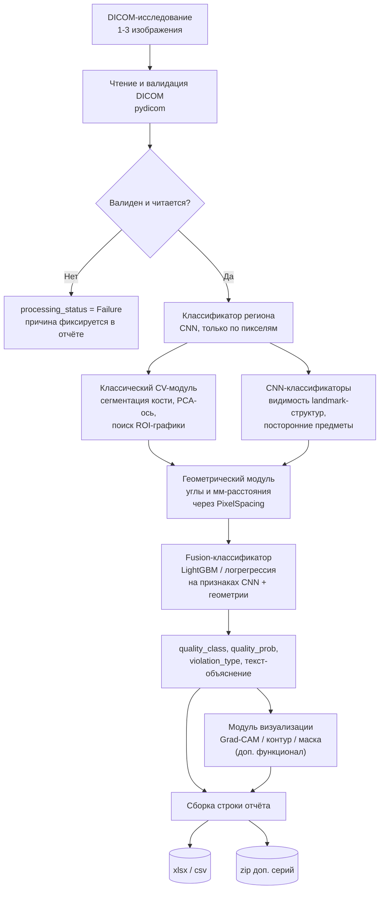

# План реализации проекта «ИИ-сервис контроля качества денситометрических исследований»

*Документ подготовлен как техлид-план для команды из 3 человек: Frontend, DevOps(DevSecOps), Backend. Актуально на сентябрь 2026 - версии библиотек зафиксировать в lock-файлах на старте спринта 0.*

## Оглавление

0. [Резюме для команды](#0-резюме-для-команды)
1. [Ключевые выводы из ТЗ, FAQ и датасета](#1-ключевые-выводы-из-тз-faq-и-датасета)
2. [Архитектура решения](#2-архитектура-решения)
3. [Технологический стек](#3-технологический-стек)
4. [Стратегия работы с данными](#4-стратегия-работы-с-данными)
5. [Контракт API и формат данных](#5-контракт-api-и-формат-данных)
6. [Дорожная карта проекта](#6-дорожная-карта-проекта)
7. [Персональные планы разработчиков](#7-персональные-планы-разработчиков)
8. [Структура репозитория](#8-структура-репозитория)
9. [Метрики качества](#9-метрики-качества)
10. [Безопасность (DevSecOps)](#10-безопасность-devsecops)
11. [Definition of Done](#11-definition-of-done)
12. [Таблица трассируемости требований (самопроверка)](#12-таблица-трассируемости-требований-самопроверка)
13. [Риски и вопросы к организаторам](#13-риски-и-вопросы-к-организаторам)
14. [Что улучшить при наличии времени](#14-что-улучшить-при-наличии-времени)

---

## 0. Резюме для команды

Делаем сервис, который берёт DICOM-исследование денситометрии (поясничный отдел позвоночника или проксимальный отдел бедра), без ручного просмотра определяет, качественное ли оно, и если нет - объясняет, что не так: некорректная укладка, не выровнена ось, посторонние предметы или неверная область измерения.

**Главное структурное решение.** В команде нет отдельной ML/DS-роли. Всю модельную часть (данные -> обучение -> инференс) ведёт **Backend-разработчик как Backend+ML**. Это единственная рабочая схема при команде из 3 человек, и это же - главный риск проекта: один человек не успеет провести полноценный ML-ресерч. Поэтому архитектура ниже сознательно избегает «тяжёлого» ML там, где задачу можно решить проще и надёжнее.

**Главное техническое решение.** В обучающих данных **нет координат ключевых точек и нет масок** - только бинарные флаги по критериям (excel-файл). Чисто нейросетевой подход к геометрическим критериям (угол оси, расстояния в см) на ~100 исследованиях будет учиться плохо и непрозрачно. Поэтому там, где критерий по сути измерение (угол, расстояние), решение строится на **классической компьютерной зрении + известном масштабе пикселя (1,05×0,6 мм)**, а не на end-to-end нейросети. Нейросети (transfer learning) оставлены там, где критерий - это распознавание/видимость структуры, а не измерение. Это гибридный подход, и он же обеспечивает требуемую по ТЗ **объяснимость** результата почти бесплатно.

**Главный вывод по рискам.** 2×H200 - это ресурс, которого с большим запасом хватит на инференс модели такого масштаба (счёт идёт на секунды, а не минуты из 3-минутного лимита). Узкое место проекта - не производительность, а **качество модели на маленькой, несбалансированной выборке**. Основные усилия команды должны идти в данные, а не в оптимизацию скорости.

План разбит на спринты с двумя контрольными точками - промежуточная сдача (MVP, п. 7.1 ТЗ) и финальная сдача (п. 7.2 ТЗ). Даты условные (относительно старта команды) - пересчитайте под реальный календарь конкурса.

---

## 1. Ключевые выводы из ТЗ, FAQ и датасета

### 1.1. Что уже зафиксировано организатором - не обсуждается, а имплементируется как есть

| Параметр | Значение | Источник |
|---|---|---|
| Масштаб пикселя | Y (строки) = 1,05 мм; X (столбцы) = 0,6 мм; один тип аппарата на весь датасет | Ответ на Вопрос 1 |
| `anatomical_region`, допустимые значения | `Поясничный отдел позвоночника`; `Проксимальный отдел бедра` (сторона лево/право не указывается) | Ответ на Вопрос 15 |
| `violation_type`, список для позвоночника | `Некорректная укладка`; `Не выравнена ось позвоночника`; `Присутствуют посторонние предметы` | Ответ на Вопрос 6 |
| `violation_type`, список для бедра | `Некорректная укладка`; `Некорректная область интереса` | Ответ на Вопрос 6 |
| Разделитель нескольких нарушений | `;` | Ответ на Вопрос 6 |
| Нарушений нет | пустая строка | Ответ на Вопрос 6 |
| Доп. колонка вероятности | `quality_prob`, float в [0;1] | Ответ на Вопрос 8 |
| Порог наклона оси позвоночника | до 5° - норма | ТЗ, рис. 2 |
| Поле ROI бедра | 3 см сверху/снизу, 2 см слева/справа от границы бедра (по стороне) | ТЗ, рис. 6 |
| Целевое железо (финальный тест) | 2 × H200 141GB, **каждая в своей отдельной ВМ** (не мульти-GPU нода!) | ТЗ п. 3.1 |

### 1.2. Ловушки, которые легко пропустить

Это список конкретных ошибок, каждая из которых один раз уже чуть не встретилась при разборе ТЗ - фиксируем явно, чтобы не наступить на них в коде.

- **Имя файла - не источник истины.** В обучающих файлах есть суффикс региона (`..._ПОП.dcm` и т.п.), но по ответу на Вопрос 15 в закрытом тестовом наборе таких суффиксов **не будет**. Если классификатор региона (даже случайно, через debug-скрипт) будет опираться на имя файла - на закрытом тесте это сломается молча и без объяснимой причины. Регион определяется **только по содержимому изображения** (плюс опционально DICOM-метаданные как вспомогательный, не обязательный сигнал - п. 2.4 ТЗ явно требует не зависеть от их наличия).
- **PixelSpacing в DICOM, скорее всего, отсутствует** (иначе не появился бы Вопрос 1). Код обязан: попытаться прочитать тег `PixelSpacing`/`ImagerPixelSpacing`, и **только если тега нет** - подставлять константу (1.05, 0.6) мм. Хардкодить константу без проверки тега - тоже ошибка (тег может внезапно быть в части файлов).
- **Формат строки `violation_type`.** Мы используем разделитель `"; "` (точка с запятой + пробел) для читаемости, но если проверка на стороне организатора делает точное сравнение строк - пробел после `;` может считаться расхождением. Зафиксировать этот момент как открытый вопрос (см. раздел 13) и сделать формат разделителя параметром конфигурации, а не хардкодом.
- **`quality_class` - это не то же самое, что среднее по `violation_type`.** Нужна отдельная обучаемая «голова» под сам факт «есть нарушение», а не производная эвристика - иначе `quality_prob` будет плохо откалиброван и ROC-AUC пострадает (см. 2.4).

### 1.3. Клинические нюансы в данных - важно для качества разметки обучающей выборки

Это ровно то, за что отдельно начисляются баллы в критерии 8.1 («понимание клинической задачи»), поэтому фиксируем явно.

| Нюанс | Комментарий в датасете | Почему это важно для модели |
|---|---|---|
| Сколиоз | Встречается часто (десятки исследований с пометкой «сколиоз») | Сколиоз - это анатомическая кривизна позвоночника пациента, а не ошибка укладки. Критерий «ось выровнена» должен отражать, насколько ровно уложен пациент (симметрия таза/дужек), а не собственную форму позвоночника. Судя по части размеченных строк, эксперты это различают (есть сколиотичные случаи с флагом оси = 0). Модель, обученная наивно «угол общего наклона силуэта», рискует путать два разных явления - держим это в голове при построении геометрического модуля (см. 2.3) и при разборе ошибок на валидации. |
| Эндопротезирование ТБС | 2 упоминания в выборке | Металлический протез радикально меняет вид проксимального отдела бедра - стандартные критерии позиционирования/ROI к такому исследованию неприменимы в обычном виде. Нужен отдельный «детектор протеза» (высокая яркость/плотность нетипичной формы - легко ловится классически) и решение, что писать в отчёт для такого случая (уточнить у организатора, см. раздел 13). |
| Люмбализация/сакрализация (пример: «L6») | 1 явное упоминание | Аномальное число поясничных позвонков сбивает «подсчёт уровней» при поиске Th12 - если модуль определения верхней границы ROI построен на подсчёте позвонков сверху вниз, на таких случаях он ошибётся системно. Один из аргументов в пользу детектора именно Th12/подвздошных костей как визуальных паттернов, а не подсчёта позвонков. |
| Перелом | 1 упоминание | Не входит в официальную таксономию `violation_type` - не пытаемся его классифицировать, но стоит убедиться, что такие случаи не портят обучение прокси-критериев (например, деформация из-за перелома может имитировать «ротацию»). |

### 1.4. Пробел в данных: нет координат ключевых точек - только бинарные флаги

Это определяет архитектуру (раздел 2). Экспертная разметка в Excel - это **бинарные/порядковые флаги по критериям на уровне исследования** («корректная укладка» 0/1, «ось выровнена» 0/1 и т.д.), а не пиксельные координаты анатомических landmark’ов и не маски сегментации. Значит:

- Полноценная heatmap-регрессия ключевых точек (стандартный подход в разметке цефалометрии/позы) **не имеет прямого таргета** в предоставленных данных и потребовала бы отдельной ручной разметки координат командой - это осознанный компромисс, а не забытая деталь.
- Отсюда - гибридная архитектура: там, где критерий - измерение (угол, расстояние), считаем его классически по сегментации + известному масштабу пикселя и **калибруем порог** по имеющимся бинарным меткам (обучающих координат не требуется вообще). Там, где критерий - распознавание («видна ли такая-то структура»), используем обучаемый классификатор на предоставленных бинарных метках напрямую.
- Самостоятельная ручная разметка landmark’ов командой - не входит в MVP, вынесена в раздел 14 как усиление при наличии времени.

---

## 2. Архитектура решения

### 2.1. Общая схема пайплайна



### 2.2. Модули и обоснование выбора подхода для каждого

| # | Модуль | Критерий ТЗ, который закрывает | Подход | Почему именно так |
|---|---|---|---|---|
| 1 | Классификатор анатомической области | «определение анатомической области и проекции» (2.2) | CNN transfer learning (EfficientNet-B0/ResNet34), вход - только пиксели | Единственный устойчивый вариант с учётом Q15 (нельзя опираться на имя файла); задача простая (2 класса, визуально контрастные), не требует много данных |
| 2 | Сегментация костной ткани | Основа для геометрии | Классический CV first (Otsu-порог + морфология + крупнейшая связная компонента); learned U-Net-lite - только если классика даёт плохое качество на валидации | Не требует разметки масок вообще; кость на денситограмме контрастна к фону - классика обычно справляется |
| 3 | Геометрический модуль (ось, ROI-расстояния) | «ось до 5°» (рис.2), «3 см / 2 см от ROI» (рис.6) | PCA/фит линии по сегментированной кости -> угол; детекция линий ROI-графики (Hough) или её границ + landmark-детектор (модуль 4) -> расстояние в мм через 1,05×0,6 мм | Это буквально измерение, а не распознавание образов - классический CV точнее, интерпретируемее и не требует таргетов, которых нет в данных (см. 1.4) |
| 4 | Классификаторы видимости структур / позиционирования | «представлены большой вертел, шейка бедра, седалищная кость» / «верхние края подвздошных костей и половина Th12» (рис.1, рис.4) | CNN, multi-label, обучается напрямую на бинарных флагах из Excel + Grad-CAM для интерпретации | Здесь нет прямого геометрического измерения - это распознавание «видна/не видна структура», для чего классификация - стандартный и достаточный инструмент при небольшом числе классов |
| 5 | Детектор посторонних предметов | «наличие посторонних предметов, артефактов» (рис.3) | Бинарный CNN-классификатор + классический эвристический признак (яркие мелкие компактные объекты вне тела кости) как доп. фича в fusion | Металл имеет характерную яркостную сигнатуру - классика хорошо дополняет скудные данные по редкому классу |
| 6 | Fusion-классификатор | Итоговые `quality_class` / `quality_prob` / `violation_type` | Градиентный бустинг (LightGBM) **или** логрегрессия/малый MLP на объединённом векторе признаков (эмбеддинги CNN + геометрические измерения + уверенности модулей 4-5) | Данных мало (десятки-сотни примеров) - табличная модель на компактном наборе признаков надёжнее, чем ещё один глубокий классификатор поверх и того, и другого |
| 7 | Генератор объяснений | «объясняет, какое именно нарушение обнаружено» (введение ТЗ) | Шаблонный текст на русском, подставляющий вычисленные числа: например, «ось отклонена на 6,9°, допустимо до 5°» | Прямое следствие того, что модуль 3 даёт числа, а не просто флаг - объяснимость получаем «бесплатно» |
| 8 | Визуализация (доп. функционал) | п. 2.6 | Grad-CAM для CNN-флагов + контур сегментации кости + отрисовка найденной оси/ROI | Низкая доп. стоимость поверх уже посчитанных модулей 2-3 |
| 9 | DICOM SR (доп. функционал) | п. 2.6 | `pydicom` + именованные константы `pydicom.uid.BasicTextSRStorage` (не набирать UID руками - источник трудноуловимых багов) | Текст объяснения из модуля 7 напрямую ложится в SR |

### 2.3. Почему гибрид, а не «чистый» end-to-end deep learning

Прямая нейросеть «картинка -> вектор нарушений» была бы проще в реализации, но:

1. На выборке из низких десятков - низких сотен исследований (именно такой порядок виден по датасету) end-to-end модель без геометрических приоритетов будет либо переобучаться, либо не научится точно попадать в 5-градусный / 2-3-сантиметровый допуск - а именно точность на границе допуска определяет F1/AUC.
2. Требование «объяснить, какое нарушение» (не просто классифицировать) для end-to-end подхода решается только приближённо (Grad-CAM), а для гибридного - напрямую (число + порог).
3. Критерий 8.1 явно оценивает «понимание клинической задачи» - гибридный подход прямо показывает, что команда поняла: часть критериев ТЗ - это метрология, а не распознавание образов.

**Важно:** это стартовая гипотеза, а не догма. В спринте 3 (раздел 6) команда эмпирически сравнивает классический и обучаемый вариант для каждого критерия на валидации и оставляет тот, что лучше - правило, а не жёсткое предписание.

### 2.4. Про `quality_prob` отдельно

По ответу на Вопрос 8 добавлена колонка вероятности - иначе ROC-AUC по бинарной `quality_class` вырождается. Чтобы `quality_prob` был содержательным (не производной от плохо откалиброванных промежуточных флагов), в fusion-классификаторе (модуль 6) заводим **отдельную голову**, обучаемую напрямую на целевой переменной «есть любое нарушение» по полному датасету, и **калибруем** её (Platt scaling / изотоническая регрессия на валидационном фолде) перед сдачей - некалиброванные вероятности на маленьких данных обычно смещены.

---

## 3. Технологический стек

### 3.1. Backend / ML

| Категория | Выбор | Обоснование |
|---|---|---|
| Язык | Python 3.11/3.12 | Стандарт для ML/CV, вся экосистема ниже - Python-first |
| Веб-фреймворк | FastAPI + Pydantic v2 + Uvicorn | Асинхронность, автогенерация OpenAPI (пригодится для фронта и для документации API из п.5 ТЗ), встроенная валидация схем ответа |
| ML-фреймворк | PyTorch (актуальная стабильная 2.x ветка на момент старта, ориентир - линейка 2.12+), сборка под CUDA 12.6/12.8 | H200 - архитектура Hopper, compute capability 9.0, официально поддерживается с CUDA 11.8, но актуальные сборки PyTorch по умолчанию используют CUDA 12.x - берём готовый образ `pytorch/pytorch:<verison>-cuda12.8-cudnn9-runtime` вместо сборки с нуля |
| Backbone-модели | `timm` (torchvision-совместимые предобученные ResNet/EfficientNet) | Большой зоопарк предобученных весов, лёгкий transfer learning, активно поддерживается |
| Аугментации | `albumentations` | Из коробки поддерживает согласованные трансформации изображение+точки+bbox - нужно для геометрического модуля |
| DICOM I/O | `pydicom` (+ `pylibjpeg` для сжатых Transfer Syntax при необходимости) | Стандарт де-факто для чтения/записи DICOM на Python, MIT-лицензия |
| Классическое CV | `opencv-python`, `scikit-image`, `numpy` | Сегментация, PCA-ось, Hough-детекция линий ROI |
| Табличная fusion-модель | `lightgbm` или `scikit-learn` (LogisticRegression/GBM) | Малый датасет табличных признаков - не нужен глубокий стек поверх стека |
| Метрики/валидация | `scikit-learn` (StratifiedGroupKFold, roc_auc_score, f1_score и т.д.) | Стандарт, всё есть из коробки, включая нужные для 8.4 метрики |
| Excel/CSV отчёт | `pandas` + `openpyxl` | Прямая запись в требуемый формат п. 2.5 |
| Batch-очередь | Без Celery/Redis на старте - простой пул воркеров (`concurrent.futures.ProcessPoolExecutor`) + статус в SQLite/JSON | При офлайн однопользовательском батч-сценарии Celery+Redis - лишняя инфраструктурная сложность; апгрейд возможен позже, если понадобится параллельная многопользовательская нагрузка |
| Опционально | MONAI (Apache 2.0, активно поддерживается NVIDIA/King's College London и в 2026) | Полезен для готовых loss-функций (Dice/Focal) и DICOM-трансформов, но заточен больше под 3D (CT/MRI) - не берём как обязательную зависимость, только точечно если пригодится |

**Явно НЕ берём:** Ultralytics YOLO - актуальная лицензия AGPL-3.0 (коммерческое использование без открытия исходного кода требует платной Enterprise-лицензии); для конкурсной сдачи с требованием передачи исходников это не блокер юридически, но реализация детекции объектов проще и без вопросов к лицензии на `torchvision.models.detection` (Faster R-CNN, BSD-стиль лицензия PyTorch) - а нам для поиска посторонних предметов чаще достаточно классификации, не детекции с координатами.

### 3.2. DevOps / DevSecOps

| Категория | Выбор | Обоснование |
|---|---|---|
| Контейнеризация | Docker, **два отдельных образа**: `Dockerfile.train` (тяжёлый, с jupyter/экспериментами - не сдаётся) и `Dockerfile.inference` (минимальный, только рантайм-зависимости) | Уменьшает поверхность атаки и размер продового образа; ускоряет пересборку при итерациях на инференс-коде |
| Базовый образ | `nvidia/cuda:12.x-runtime-ubuntu22.04` или официальный `pytorch/pytorch:*-cuda12.8-cudnn9-runtime` | Совместимость с Hopper (H200) подтверждена - CUDA 12.6/12.8 это mainstream-ветки PyTorch на 2026 год |
| Оркестрация локально | Docker Compose (API + воркер, при необходимости - общий volume с весами) | Минимально достаточно для локального однохостового офлайн-сервиса, не требует Kubernetes |
| CI | GitHub Actions (lint, unit-тесты, сборка образа, security-сканы на каждый PR) | Стандарт, бесплатно для команд такого размера |
| Lint/формат | `ruff` + `black` + `mypy` (опционально) | Быстро, единая конфигурация, минимум конфликтов на старте |
| Security-сканы | `trivy` (образы), `pip-audit` (Python-зависимости), `bandit` (статический анализ), `gitleaks` (секреты в git-истории) | Прямое требование DevSecOps-роли и раздела 10 ниже |
| Фиксация версий | `pip-compile`/`poetry.lock` + пины по хэшам, Docker-образ с точным тегом/дайджестом | Прямое требование п. 3.2 ТЗ («все версии зафиксированы») |
| Мониторинг/логи | Структурные JSON-логи (`structlog`/стандартный `logging` + JSON-formatter), ротация; полноценный Prometheus/Grafana - опционально (раздел 14), не MVP | Соразмерно масштабу задачи (офлайн батч-сервис, не высоконагруженный прод) |

### 3.3. Frontend

| Категория | Выбор | Обоснование |
|---|---|---|
| Стек | React + TypeScript + Vite | Быстрый старт, TS снижает число runtime-ошибок при интеграции с API |
| UI-библиотека | Ant Design (богатые готовые компоненты: таблицы, загрузка файлов, прогресс) либо Tailwind, если нужен более кастомный вид | Ant Design ускоряет реализацию табличного результата и upload-формы - приоритет функционала над уникальным дизайном при таком составе команды |
| Данные/запросы | TanStack Query (React Query) | Убирает руками написанный boilerplate для поллинга статуса батч-задачи |
| Просмотр DICOM | **Не встраиваем** тяжёлые DICOM-вьюеры (Cornerstone.js и т.п.) на фронте | Backend уже рендерит превью в PNG для каждого изображения - фронту нужно показать обычную картинку + оверлей, а не парсить DICOM в браузере. Это осознанное упрощение, экономящее фронтенд-разработчику много времени |

### 3.4. Единственная жёсткая аппаратная деталь, которую нельзя не учесть

H200 - архитектура Hopper (compute capability 9.0), формально поддерживается с CUDA 11.8, но экосистема PyTorch/NVIDIA на 2026 год уже стандартно собирается под CUDA 12.6/12.8/13.0 - **закладываем CUDA 12.x**, а не более старую версию из старых туториалов/образов. Второй момент: по ТЗ - **это 2 отдельные ВМ по одному H200**, не единая мульти-GPU нода. Решение проектируем под инференс на одной GPU; распределённый (multi-GPU) инференс - не нужен и будет лишней сложностью.

---

## 4. Стратегия работы с данными

### 4.1. EDA (спринт 0, обязательно до первой строчки кода модели)

- Посчитать реальный объём полного датасета `НД_для_обучения` (в примере видно 100 строк - вероятно, это не весь набор; нужно свериться с реальным количеством файлов в архиве).
- Построить распределение классов по каждому из 5 бинарных критериев (3 для позвоночника, 2 для бедра) - ожидаемо сильный дисбаланс (в примере доля «1» - явное меньшинство).
- Проверить, сколько исследований размечены **полностью** (все применимые колонки), а сколько - частично (в примере видно много пустых ячеек, например для исследований без одной из сторон бедра).
- Отдельно выделить исследования с пометками в комментариях (сколиоз, эндопротезирование, перелом, люмбализация) - не выкидывать, но промаркировать для отдельного контроля на валидации.
- Проверить, есть ли в датасете повторные пациенты (по доступным DICOM-тегам, если они не удалены при деидентификации) - важно для группировки при разбиении выборки.

### 4.2. Разбиение выборки и защита от утечек (критерий 8.1)

- Группировка по `study_uid` (а если возможно определить - по пациенту) - все изображения одного исследования остаются в одном фолде.
- **Stratified Group K-Fold** (например, 5 фолдов), стратификация по «есть ли хотя бы одно нарушение» и по возможности - по типу нарушения.
- Итоговая метрика на защиту - среднее по фолдам ± bootstrap 95% ДИ (раздел 9).
- Модель на сдачу: либо ансамбль из K моделей по фолдам (усреднение предсказаний), либо финальное переобучение на всём датасете с гиперпараметрами, подобранными по CV - выбор фиксируется в документации по обучению.
- Нормализация (среднее/std для изображений) считается **только** по обучающей части каждого фолда - не по всему датасету целиком.

### 4.3. Дисбаланс классов

- Взвешивание loss (обратная частота классов) или focal loss для CNN-классификаторов.
- Балансированный батч-семплер (oversampling редкого класса на уровне батча) как альтернатива/дополнение.
- Порог классификации подбирается на валидации под F1/balanced accuracy, а не берётся по умолчанию 0.5.
- Отчётность - обязательно balanced accuracy, F1, ROC-AUC/PR-AUC (не raw accuracy, который бессмысленен при таком дисбалансе).

### 4.4. Аугментации - с учётом геометрической чувствительности критериев

Критично: часть критериев - это сами по себе углы и расстояния, поэтому аугментации, которые их искажают, **должны быть либо исключены, либо сопровождаться пересчётом лейбла**, что почти никогда не стоит того на маленьких данных. Практическое правило:

- Разрешено без ограничений: яркость/контраст/гамма, лёгкий гауссов шум, лёгкое размытие - не трогают геометрию.
- Повороты/сдвиги - только в пределах, которые точно не пересекают клинический порог (например, аугментационный поворот ±2° для «нормальных» примеров безопасен для 5°-порога, но не для примеров, уже близких к границе) - либо не поворачивать вовсе для обучающих примеров модуля геометрии, доверяя классическому измерению, а аугментировать только вход CNN-классификаторов видимости структур (модуль 4), где точный угол не є таргетом.
- Горизонтальное отражение для бедра - только если модель не должна различать сторону (по Q15 сторона не требуется в выводе) - но проверить, не ломает ли отражение семантику ROI-критерия (лево/право по-разному считается по ТЗ рис.6).

### 4.5. Использование неразмеченной части датасета

По ТЗ п. 6 организатор предоставляет обезличенные изображения, **часть** из которых с экспертной разметкой - значит, часть данных размечена не полностью. Неразмеченные/частично размеченные примеры можно использовать для:
- Самообучения backbone (даже простой fine-tuning на реконструкцию/контрастное обучение) при наличии времени - вынесено в раздел 14 как опциональное усиление, не блокирует MVP.
- Ручной визуальной проверки edge-кейсов (протезы, сколиоз) для калибровки классического геометрического модуля без необходимости в лейблах вообще.

---

## 5. Контракт API и формат данных

### 5.1. Интерфейсы - сразу оба, т.к. неизвестно, как именно организатор будет прогонять закрытый тест

**CLI (основной путь для автоматической пакетной проверки):**
```
python -m src.cli.batch_process \
  --input /path/to/dicom_folder_or_zip \
  --output /path/to/results \
  --format xlsx
```

**REST API (для интерактивного UI и как формальная реализация п.3.2 ТЗ):**

| Метод | Путь | Назначение |
|---|---|---|
| POST | `/api/v1/batch` | Запуск пакетной обработки (архив или путь), возвращает `job_id` |
| GET | `/api/v1/batch/{job_id}/status` | Статус задачи (queued/running/done/failed), прогресс |
| GET | `/api/v1/batch/{job_id}/result` | Скачать результат (xlsx/csv + zip доп. серий) |
| POST | `/api/v1/study` | Обработка одного изображения синхронно (для предпросмотра в UI) |
| GET | `/api/v1/health` | Health-check контейнера |

Оба интерфейса вызывают один и тот же core-пакет (`src/`) - никакой логики не дублируется между CLI и API.

### 5.2. Формат выходной таблицы (одна строка = одно изображение/область)

| Колонка | Тип | Значения/формат |
|---|---|---|
| `path_to_study` | String | путь к исходному файлу/исследованию |
| `study_uid` | String | `StudyInstanceUID` из DICOM |
| `image_uid` | String | `SOPInstanceUID` из DICOM |
| `anatomical_region` | String | `Поясничный отдел позвоночника` \| `Проксимальный отдел бедра` |
| `quality_class` | Integer | 0 - качественное, 1 - есть нарушение |
| `quality_prob` | Float | вероятность нарушения, [0;1] *(добавлено по ответу на Вопрос 8)* |
| `violation_type` | String | из закрытого списка (см. 1.1), несколько - через `; `, нет - пусто |
| `processing_status` | String | `Success` \| `Failure` |
| `time_of_processing` | Float | секунды |

### 5.3. Обработка ошибок - прямое требование п. 2.7 ТЗ

Каждое изображение обрабатывается в собственном `try/except`; при любой ошибке (битый DICOM, нераспознанный регион, неожиданный размер и т.д.) строка результата всё равно формируется, с `processing_status = Failure` и причиной в отдельном лог-файле/поле - **батч не должен падать целиком из-за одного плохого файла**. Это отдельный, явный пункт тестирования (раздел 7.1, Backend).

---

## 6. Дорожная карта проекта

Даты - относительные (день 1 = старт команды), общая длительность ориентировочно 6 спринтов. Подставьте реальные даты конкурса; порядок и зависимости между спринтами важнее точных чисел.

```mermaid
gantt
    dateFormat  YYYY-MM-DD
    title Дорожная карта (относительные даты от старта команды)
    excludes weekends

    section Backend/ML
    Настройка окружения и EDA          :b1, 2026-01-01, 5d
    Baseline: 1 регион, бинарный класс :b2, after b1, 7d
    Геометрический модуль (ось, ROI)   :b3, after b2, 6d
    Второй регион + fusion-модель      :b4, after b3, 7d
    Визуализация, DICOM SR, калибровка :b5, after b4, 6d
    Тесты, метрики с ДИ, стабилизация  :b6, after b5, 6d

    section DevOps-DevSecOps
    Docker train+inference образы      :d1, 2026-01-01, 4d
    CI, линт, security-сканы           :d2, after d1, 5d
    Batch API-CLI, интеграция          :d3, after d2, 6d
    Network-egress и нагрузочный тест  :d4, after d3, 5d
    Финальная сборка под H200, релиз   :d5, after d4, 5d

    section Frontend
    Каркас приложения                  :f1, 2026-01-01, 4d
    Загрузка и статус задачи           :f2, after f1, 6d
    Таблица результатов и экспорт      :f3, after f2, 6d
    Просмотр изображений и оверлеи     :f4, after f3, 6d
    Полировка UI, демо-сценарий        :f5, after f4, 5d
```

### Спринт 0 - Подготовка (дни 1-3, кросс-функционально)
Общий синк перед разъездом по ролям: зафиксировать API-контракт (раздел 5) - без него Frontend и Backend не смогут работать параллельно; провести EDA (4.1); согласовать базовый Docker-образ (нужен Backend-у для консистентной среды разработки).

### Спринты 1-2 - MVP (соответствует п. 7.1 ТЗ)
Backend: baseline для одного региона (рекомендация - начать с позвоночника, там больше критериев и он первый в ТЗ, но решение принимается по факту EDA - с каким регионом данных больше/чище), бинарная `quality_class`, ROI/разметка хотя бы для одного региона, файл результатов в нужном формате. DevOps: рабочий Docker-образ, базовый CI. Frontend: каркас + форма загрузки.

**Контрольная точка MVP:** обученная модель + скрипт инференса; чтение DICOM + батч; бинарный класс; оценка разметки для ≥1 региона; файл результатов; метрики на валидации; краткая инструкция; описание ограничений и план доработки.

### Спринт 3 - Полный функционал
Второй регион, все `violation_type`, геометрический модуль, fusion-классификатор с `quality_prob`, калибровка.

### Спринт 4 - Доп. функционал
Визуализация нарушений, DICOM SR, финальная полировка UI (просмотр, batch-экспорт).

### Спринты 5-6 - Стабилизация и финальная сдача (соответствует п. 7.2 ТЗ)
DevSecOps-аудит, нагрузочное тестирование (проверка честного укладывания в 3 минуты - с огромным запасом на H200, но нужно формально измерить и задокументировать), финализация документации, репетиция презентации, финальная сборка.

---

## 7. Персональные планы разработчиков

### 7.1. Backend / ML-разработчик

**Спринт 0**
- Поднять окружение (Python, PyTorch+CUDA 12.x, зависимости из 3.1) в Docker, чтобы вся команда работала в одинаковой среде.
- Провести EDA (4.1), зафиксировать выводы (объём данных, дисбаланс, полнота разметки) - это база для всех дальнейших решений.
- Реализовать модуль чтения DICOM с валидацией (битые файлы -> понятная ошибка, не падение процесса).
- Согласовать и задокументировать API-контракт (раздел 5) с Frontend.

**Спринты 1-2 (MVP)**
- Классификатор региона (модуль 1) - обучить и **явно протестировать, что не подсматривает в имя файла** (например, тест: переименовать тестовые файлы в случайные имена, метрика не должна упасть).
- Классическая сегментация кости (Otsu + морфология) + PCA-угол оси для позвоночника; калибровка порога 5° по бинарным меткам.
- CNN-классификатор видимости landmark-структур (модуль 4) для одного региона, обучение с class weighting.
- Первая версия fusion-логики (можно начать с простого правила «любой из флагов = 1» -> `quality_class = 1`, доработать до полноценной модели в спринте 3).
- Report-writer: запись в xlsx/csv строго по схеме раздела 5.2, включая `quality_prob`.
- Обязательно: try/except вокруг обработки каждого файла, `processing_status`, воспроизводимость (фиксация seed).
- Посчитать базовые метрики (раздел 9) на валидационном фолде.

**Спринт 3**
- Второй регион (бедро): позиционирование/ротация + ROI-модуль (детекция ROI-графики на изображении + landmark для отсчёта + перевод пикселей в мм через 1,05×0,6 мм).
- Детектор посторонних предметов (модуль 5).
- Полноценный fusion-классификатор (LightGBM/логрегрессия) на объединённых признаках, отдельная калиброванная голова под `quality_prob`.
- Сборка строки `violation_type` строго по спискам из раздела 1.1, разделитель - параметр конфигурации.
- Эмпирическое сравнение классика vs. CNN на каждом геометрическом критерии - оставить лучшее по валидации (это прямое действие из раздела 2.3).

**Спринт 4**
- Генератор текстовых объяснений (шаблоны на русском, подстановка вычисленных чисел).
- Grad-CAM/контур для визуализации (доп. серия).
- DICOM SR через `pydicom.uid.BasicTextSRStorage` (не набирать UID вручную).

**Спринты 5-6**
- Bootstrap 95% ДИ для всех метрик (раздел 9).
- Регресс-тесты: сравнение метрик с предыдущей версией модели перед каждым релизом.
- Финализация README-разделов про модель, предобработку, обучение/дообучение (документация - живой процесс, не «в последний день»).
- Профилирование времени обработки (документируется мин/рек конфигурация по п. 3.1 ТЗ).

### 7.2. DevOps / DevSecOps-инженер

**Спринт 0**
- `Dockerfile.train` и `Dockerfile.inference` (раздел 3.2), база - официальный PyTorch-образ с CUDA 12.x, совместимый с Hopper/H200.
- `docker-compose.yml` для локального запуска API+воркер.
- Скелет CI (lint + тесты на пустом проекте, чтобы пайплайн был готов до появления кода).
- `build.sh` / `run.sh` - заглушки, дорабатываются по мере готовности сервиса.

**Спринты 1-2 (MVP)**
- CI: юнит-тесты, сборка образа на каждый PR.
- Security-сканы в CI: `trivy` (образ), `pip-audit` (зависимости), `bandit` (статический анализ), `gitleaks` (секреты).
- Lock-файлы зависимостей (`pip-compile`/`poetry.lock`) - версии зафиксированы с первого дня, не «потом соберём».
- `.env.example`, никаких секретов в репозитории.

**Спринт 3**
- Интеграция batch API/CLI в контейнер, тест полного цикла «вход -> выход» в Docker.
- Non-root пользователь в контейнере, read-only файловая система там, где возможно.
- Защита от zip-slip при распаковке архивов исследований (конкретная, проверяемая уязвимость для функционала загрузки батча - обязательно покрыть тестом с вредоносным именем файла в архиве, например `../../etc/passwd`).
- Ограничение размера/типа принимаемых файлов на API.

**Спринт 4**
- Настройка сборки zip-архива с доп. сериями (визуализациями) как части batch-результата.
- Базовое логирование (структурные JSON-логи, ротация), проверка отсутствия PII/чувствительных данных в логах.

**Спринты 5-6**
- **Верификация полной офлайн-работоспособности**: запуск контейнера с `--network none` (или закрытой сетью без доступа наружу) и прогон на тестовых данных - конкретное, воспроизводимое доказательство соответствия п. 3.2 ТЗ («без обращения к внешним сервисам»), а не декларация в README.
- Нагрузочный тест: прогон полного тестового набора, замер времени на исследование, сравнение с лимитом 3 минуты (с учётом реальной H200-конфигурации, если есть доступ, иначе - на ближайшем доступном GPU с пересчётом).
- Финальная сборка образа под целевую конфигурацию (одна ВМ = один H200, без мульти-GPU оркестрации), тег/дайджест образа фиксируется в документации.
- SBOM (например, `syft`) как приложение к документации - плюс к критерию «техническая проработка» (8.2).
- Проверка воспроизводимости: два независимых запуска на одинаковых данных дают одинаковый результат.

### 7.3. Frontend-разработчик

**Спринт 0**
- Каркас React+TS+Vite проекта, интеграция с OpenAPI-схемой от Backend (FastAPI генерирует её автоматически - берём оттуда типы, не пишем вручную).
- Согласование контракта API (раздел 5) до начала верстки экранов.

**Спринты 1-2 (MVP)**
- Экран загрузки исследования/архива.
- Экран статуса батч-задачи (поллинг через TanStack Query).
- Минимальная таблица результатов, отражающая схему из раздела 5.2.

**Спринт 3**
- Полноценная таблица результатов: сортировка/фильтр по `anatomical_region`, `quality_class`, `violation_type`.
- Экспорт/скачивание xlsx/csv и zip.

**Спринт 4**
- Просмотр изображения исследования (backend отдаёт готовый PNG-превью - фронт не парсит DICOM сам, см. 3.3) с переключаемым оверлеем визуализации нарушения (маска/контур/heatmap от Backend).
- UI-полировка, подготовка демо-сценария для питч-сессии (раздел 4 ТЗ - что именно показывать).

**Спринты 5-6**
- Проверка UI на пограничных случаях (`processing_status = Failure`, пустой `violation_type`, очень большой батч).
- Финальная сборка фронтенда в общий Docker Compose (или отдельный статический билд, встраиваемый в общий контейнер - решить с DevOps исходя из требования «единый скрипт сборки и запуска»).
- Участие в репетиции демо.

---

## 8. Структура репозитория

```
project-root/
├── README.md
├── docker/
│   ├── Dockerfile.train
│   ├── Dockerfile.inference
│   └── docker-compose.yml
├── scripts/
│   ├── build.sh
│   ├── run.sh
│   └── run_batch.sh
├── configs/
│   ├── pixel_spacing.yaml       # 1.05 / 0.6 мм - fallback, если нет тега DICOM
│   ├── thresholds.yaml          # 5°, 3см, 2см и пр. - не хардкодить в коде
│   └── model.yaml
├── weights/                     # веса моделей - версионируются отдельно (не в git)
├── src/
│   ├── api/                     # FastAPI: main.py, routers/, schemas.py
│   ├── cli/                     # batch_process.py - та же логика, что и API
│   ├── dicom_io/                # чтение DICOM, запись DICOM SR
│   ├── preprocessing/
│   ├── models/
│   │   ├── region_classifier/
│   │   ├── positioning_classifier/
│   │   ├── foreign_object_detector/
│   │   └── geometry/            # классический CV-модуль (сегментация, PCA, Hough)
│   ├── fusion/                  # финальный классификатор
│   ├── explain/                 # генератор текстовых объяснений
│   ├── visualization/           # Grad-CAM, контуры
│   ├── report/                  # xlsx/csv writer
│   └── training/                # скрипты и конфиги обучения
├── tests/
├── notebooks/                   # EDA и эксперименты - НЕ попадает в inference-образ
├── docs/
│   ├── README.md
│   ├── USER_GUIDE.md
│   ├── DEPLOYMENT_GUIDE.md
│   └── TRAINING_GUIDE.md
└── frontend/
    └── src/
```

---

## 9. Метрики качества

| Метрика | Уровень расчёта | Комментарий |
|---|---|---|
| Sensitivity (recall) | по региону, по типу нарушения, в целом | п. 8.4 ТЗ |
| Specificity | по региону | п. 8.4 ТЗ |
| Balanced accuracy | по региону | важна из-за дисбаланса |
| F1 | по региону, по типу, в целом | приоритетная клиническая метрика по ТЗ |
| ROC-AUC / PR-AUC | по `quality_prob` | приоритетная метрика; PR-AUC информативнее ROC-AUC при сильном дисбалансе - считать обе |
| Macro-F1 | по списку `violation_type` внутри каждого региона | для мультилейбл-классификации нарушений |
| Dice / IoU / расстояние между точками | только если реализована сегментация/визуализация | опционально, п. 8.4 |
| Время обработки, % успешных файлов | по всему прогону | п. 2.7, 8.4 |

**Доверительные интервалы (п. 8.4 - «желательно 95% ДИ»):** bootstrap-ресэмплинг валидационного набора (N ~1000 итераций с возвращением), метрика пересчитывается на каждой выборке, ДИ - 2.5/97.5 перцентили. Реализуется как отдельная утилита в `src/training/metrics.py`, переиспользуется и для отчёта в документации, и в презентации.

---

## 10. Безопасность (DevSecOps)

- Никаких секретов в коде/образе - только `.env` (не в git) + `.env.example` в репозитории.
- Защита от zip-slip при распаковке загружаемых архивов исследований (см. 7.2).
- Ограничение размера и типа загружаемых файлов на API-уровне.
- Сканирование образа (`trivy`) и Python-зависимостей (`pip-audit`) в CI перед каждым релизом.
- Статический анализ кода (`bandit`), поиск случайно закоммиченных секретов (`gitleaks`).
- Non-root пользователь в контейнере, read-only файловая система там, где не требуется запись.
- **Подтверждённая офлайн-работоспособность**: тестовый прогон в сети без доступа в интернет (`--network none`) - формальное доказательство соответствия п. 3.2 ТЗ.
- Веса моделей вшиты в образ на этапе сборки (никаких загрузок весов из интернета в момент инференса).
- Логи без PII и без чувствительных данных исследований.
- SBOM для итоговой сборки (например, `syft`) - усиливает раздел документации по критерию 8.2.

---

## 11. Definition of Done

### 11.1. MVP - промежуточная сдача (соответствует п. 7.1 ТЗ)
- [ ] Обученная модель + скрипт инференса
- [ ] Модуль чтения DICOM и пакетной обработки
- [ ] Бинарный класс «качественное / есть нарушение» - минимум для одного региона
- [ ] Оценка корректности разметки - минимум для одного региона
- [ ] Файл результатов в согласованном формате (включая `quality_prob`)
- [ ] Расчёт основных метрик на валидационной выборке
- [ ] Краткая инструкция по работе с моделью
- [ ] Описание текущих ограничений и план доработки

### 11.2. Финальная сдача (соответствует п. 7.2 ТЗ)
- [ ] Обученная модель и все веса
- [ ] Контейнеризированный сервис
- [ ] Поддержка обеих анатомических областей и всех `violation_type`
- [ ] Скрипт сборки и запуска для Linux/Unix + инструкция
- [ ] Устойчивая пакетная обработка (закрытый тестовый набор не должен «ронять» сервис)
- [ ] Структурированный файл результатов
- [ ] Полный комплект документации (README, руководство пользователя, руководство по развёртыванию, описание обучения/дообучения)
- [ ] Презентация и демонстрационный сценарий
- [ ] Исходный код / комплект материалов по правилам конкурса

---

## 12. Таблица трассируемости требований (самопроверка)

Прямая проверка «каждое требование ТЗ закрыто конкретным пунктом плана» - то, что было явно запрошено как повторная проверка стека и плана.

| Требование ТЗ | Раздел плана |
|---|---|
| 2.2 Определение региона и проекции | Модуль 1 (2.2), Backend спринт 1-2 |
| 2.2 Классификация качественное/нарушение | Модуль 6 (fusion), `quality_class`/`quality_prob` (2.4) |
| 2.2 Оценка укладки/позиционирования | Модуль 4 + модуль 3 (2.2) |
| 2.2 Оценка разметки/ROI | Геометрический модуль 3 (2.2) |
| 2.2 Определение типов нарушений | Multi-label -> строка `violation_type` строго по спискам из 1.1 |
| 2.2 Структурированный отчёт | Report-writer, раздел 5.2 |
| 2.3 Таксономия нарушений (3 для ПОП, 2 для бедра) | Зафиксировано дословно в 1.1 из ответа на Вопрос 6 |
| 2.4 Независимость от PII | Регион/качество определяются по пикселям, метаданные - не обязательный вспомогательный сигнал |
| 2.5 Формат выходных данных | Раздел 5.2, включает `quality_prob` (Вопрос 8) |
| 2.6 Визуализация | Модуль 8, Backend спринт 4 |
| 2.6 DICOM SR | Модуль 9, Backend спринт 4 |
| 2.6 Веб-интерфейс | Раздел 3.3, 7.3, все спринты Frontend |
| 2.7 Время ≤ 3 мин | DevOps спринт 5-6 (замер); риск низкий - обосновано в разделе 0 |
| 2.7 Без необработанных исключений | try/except на уровне файла, `processing_status`, раздел 5.3 |
| 2.7 Воспроизводимость | Seed, лок-файлы, два независимых прогона (DevOps спринт 5-6) |
| 2.7 Пакетная обработка + xlsx/csv + zip | API/CLI (раздел 5.1), DevOps спринт 3-4 |
| 3.1 Мин/рек конфигурация | Замеряется и документируется DevOps, спринт 5-6 |
| 3.2 Контейнеризация | Раздел 3.2, DevOps все спринты |
| 3.2 Скрипт сборки/запуска Linux/Unix | `build.sh`/`run.sh`, раздел 8 |
| 3.2 Локальный запуск без внешних сервисов | Проверка `--network none`, раздел 10 |
| 3.2 API для пакетной обработки | Раздел 5.1 (REST + CLI) |
| 3.2 Фиксация версий зависимостей | Lock-файлы, пины образа - раздел 3.2 |
| 5. README и документация | Живой документ с первого спринта, раздел 7.1/7.2 |
| 7.1 / 7.2 Требования к сдачам | Раздел 11 (Definition of Done) - построчное соответствие |
| 8.1 Таксономия, дисбаланс, утечка данных | Раздел 4.2-4.3, явные клинические нюансы в 1.3 |
| 8.4 Метрики с 95% ДИ | Раздел 9, bootstrap-методология |

---

## 13. Риски и вопросы к организаторам

Список конкретных неоднозначностей, которые не закрыты имеющимся ТЗ/FAQ и на которые стоит получить ответ до глубокой реализации - часть из них меняет архитектурные решения, поэтому лучше выяснить рано:

1. Как в эталонной разметке трактуются случаи сколиоза - считается ли анатомическая кривизна нарушением критерия «ось выровнена», или критерий относится только к позиционированию пациента (см. 1.3)? Это напрямую влияет на то, какой сигнал должен использовать геометрический модуль.
2. Как должны обрабатываться исследования с эндопротезированием - это отдельная категория вне стандартных критериев, или к ним применяются те же правила?
3. Каков полный объём обучающей выборки (в примере - 100 исследований; предположительно это не весь датасет)?
4. Точный формат разделителя в `violation_type` - `";"` без пробела или `"; "` с пробелом - критично, если проверка результатов автоматическая и сравнивает строки точно.
5. Что писать в `anatomical_region`, если исследование не относится ни к одному из двух регионов (аномальный/нераспознанный вход) - оставить пустым, вернуть `Failure` в `processing_status`, или ввести отдельное значение?
6. ROI-графика (рамка измерения) - она физически присутствует на пикселях входного DICOM (нарисована аппаратом), или её нужно определять исключительно по анатомии без визуальной опоры? Это меняет реализацию геометрического модуля.
7. Версия драйвера NVIDIA/CUDA, реально установленная на финальных ВМ с H200 - для точного подбора базового Docker-образа без риска несовместимости в последний момент.
8. Будет ли автоматическая проверка на закрытом наборе дёргать HTTP API или запускать CLI-скрипт напрямую - определяет приоритет между двумя интерфейсами раздела 5.1.

---

## 14. Что улучшить при наличии времени

Не входит в обязательный объём, но повышает шансы на призовые места по критериям технической проработки (8.2) и эффективности (8.4):

- Самостоятельная разметка landmark-точек командой на подвыборке (30-80 изображений) для обучения полноценного keypoint-детектора поверх классического CV-модуля - повышает точность геометрических измерений там, где классика справляется хуже (например, сильно зашумлённые снимки).
- Самообучение (self-supervised pretraining) backbone на неразмеченной части датасета перед fine-tuning - может дать прирост при малом числе размеченных примеров.
- Экспорт финальной модели в ONNX / ONNX Runtime для более лёгкого и стабильного production-образа, отделённого от полного PyTorch-стека для обучения.
- Автоматическая коррекция разметки с подтверждением специалистом (доп. функционал п. 2.6) - реализуется поверх уже готового геометрического модуля как отдельный UI-флоу.
- Базовый Prometheus/Grafana мониторинг для демонстрации production-зрелости решения на презентации.
